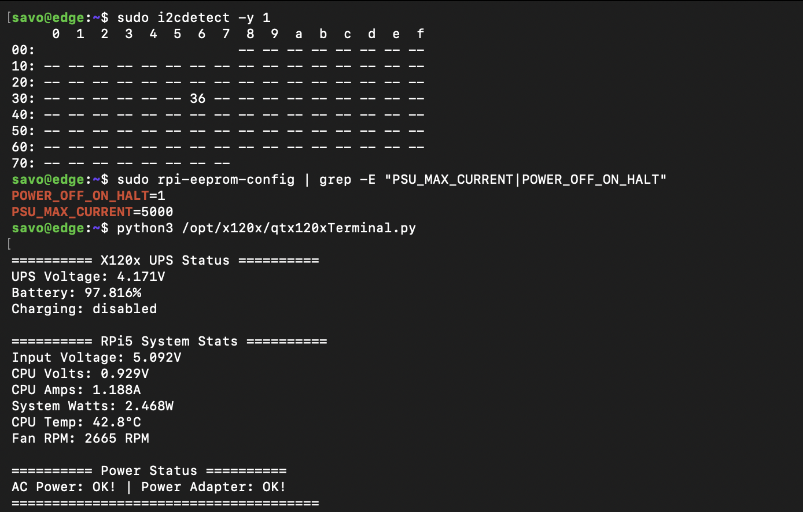

# Power Architecture

Power distribution, voltage rails, protection, battery, and shutdown behaviour.

## UPS HAT power architecture

Both `savo-core` and `savo-edge` use the same UPS HAT style and configuration on their respective Raspberry Pi 5 units.

### Power path

```
Power adapter (USB-C or barrel)
        │
        ▼
  UPS HAT input
  ┌─────────────┐
  │  Battery     │  ← 18650 cells, on-board charge management
  │  management  │
  └──────┬──────┘
         │
         ▼
  GPIO header → Raspberry Pi 5 (5V rail)
```

The HAT sits in-line between the wall adapter and the Pi. When wall power is present, the HAT charges the battery and powers the Pi. When wall power is lost, the battery takes over with no observable dropout on the Pi.

### Key properties

- Fuel gauge chip at I2C address `0x36` — voltage, capacity, and charge state readable in software
- `POWER_OFF_ON_HALT=1` ensures a Pi `shutdown` command also cuts HAT output, preventing idle battery drain
- `PSU_MAX_CURRENT=5000` (5 A) supports Pi 5 plus all attached peripherals

### Validation image



### Setup reference

See [`../setup/ups_hat_setup.md`](../setup/ups_hat_setup.md) for full installation, I2C check, EEPROM configuration, and fan profile steps.
