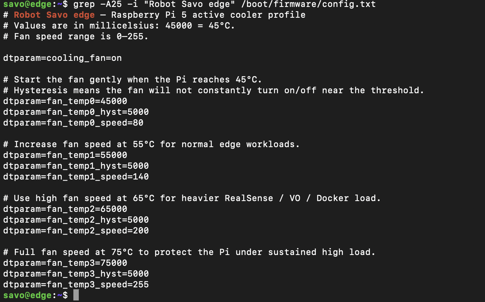

# Savo Edge Component Validation

This document records standalone hardware and system validation for the `savo-edge` Raspberry Pi 5.

Each component is tested independently before it is integrated into ROS 2 launch files, Docker services, or long-running robot services. This keeps hardware debugging separate from software integration and gives the project a clear validation record.

## Savo Edge role

`savo-edge` is responsible for edge-side sensing, audio, vision, visual odometry, UI support, and helper AI/server workloads.

Current planned responsibilities include:

* RealSense / depth processing
* visual odometry
* speech input and output
* Robot Savo Server / Docker helper services
* UI or display-side support when needed
* power monitoring through the UPS HAT

## Validation rule

A component should not be treated as ready for integration until the standalone test confirms:

* the physical connection is correct
* the expected device/interface is detected
* the diagnostic command or script produces valid output
* screenshot or log evidence is saved
* any known issue is documented

## Validation table

| Component                           | Interface          | Test command                                                             | Expected result                                                                  | Status  | Evidence                                 |
| ----------------------------------- | ------------------ | ------------------------------------------------------------------------ | -------------------------------------------------------------------------------- | ------- | ---------------------------------------- |
| UPS HAT fuel gauge                  | I2C-1              | `sudo i2cdetect -y 1`                                                    | UPS visible at `0x36`                                                            | Passed  | `../assets/hardware/ups_hat.png`         |
| UPS HAT monitor                     | I2C / GPIO         | `python3 /opt/x120x/qtx120xTerminal.py`                                  | Battery, voltage, AC power, adapter status, CPU temperature, and fan RPM visible | Passed  | `../assets/hardware/ups_hat.png`         |
| Raspberry Pi 5 EEPROM power profile | EEPROM config      | `sudo rpi-eeprom-config \| grep -E "PSU_MAX_CURRENT\|POWER_OFF_ON_HALT"` | `POWER_OFF_ON_HALT=1` and `PSU_MAX_CURRENT=5000`                                 | Passed  | `../assets/hardware/ups_hat.png`         |
| Raspberry Pi 5 fan profile          | Firmware config    | `grep -A25 -i "Robot Savo edge" /boot/firmware/config.txt`               | Fan thresholds configured at 45°C, 55°C, 65°C, and 75°C                          | Passed  | `../assets/hardware/pi5_fan_profile.png` |
| RealSense D435                      | USB / camera       | Pending                                                                  | Depth and color streams available                                                | Pending | Pending                                  |
| ReSpeaker mic array                 | USB audio          | Pending                                                                  | Microphone input detected and usable                                             | Pending | Pending                                  |
| Speaker / audio output              | USB / audio        | Pending                                                                  | Test sound or TTS audio plays correctly                                          | Pending | Pending                                  |
| STT pipeline                        | Audio / software   | Pending                                                                  | Spoken command is converted to text                                              | Pending | Pending                                  |
| TTS pipeline                        | Audio / software   | Pending                                                                  | Robot speech output is generated and played                                      | Pending | Pending                                  |
| Visual odometry                     | RealSense / ROS 2  | Pending                                                                  | VO odometry topic is published                                                   | Pending | Pending                                  |
| Robot Savo Server                   | Docker / network   | Pending                                                                  | LLM/STT helper services start and respond                                        | Pending | Pending                                  |
| Network identity                    | Wi-Fi / mDNS / SSH | `ssh savo@edge.local`                                                    | Login opens `savo@edge:~$`                                                       | Passed  | Optional screenshot later                |

## UPS HAT validation

The UPS HAT was validated on `savo-edge` after completing the shared UPS HAT setup procedure.

Setup guide:

```text
docs/setup/ups_hat_setup.md
```

The same UPS HAT setup procedure can be reused for `savo-core` when the same Raspberry Pi 5 UPS HAT is installed. Validation evidence is still tracked separately because each Pi has different hardware responsibilities.

### UPS HAT evidence


This screenshot confirms:

* UPS HAT detected on I2C bus 1 at `0x36`
* Raspberry Pi 5 EEPROM power settings are configured:

  * `POWER_OFF_ON_HALT=1`
  * `PSU_MAX_CURRENT=5000`
* UPS monitor runs from `/opt/x120x/qtx120xTerminal.py`
* battery percentage is visible
* UPS voltage is visible
* input voltage is visible
* CPU temperature is visible
* fan RPM is visible
* AC power status is visible
* power adapter status is visible

### Commands used

```bash
sudo i2cdetect -y 1
```

Expected result:

```text
30: -- -- -- -- -- -- 36 -- -- -- -- -- -- -- -- --
```

EEPROM power profile check:

```bash
sudo rpi-eeprom-config | grep -E "PSU_MAX_CURRENT|POWER_OFF_ON_HALT"
```

Expected result:

```text
POWER_OFF_ON_HALT=1
PSU_MAX_CURRENT=5000
```

UPS monitor command:

```bash
python3 /opt/x120x/qtx120xTerminal.py
```

Expected output includes:

```text
UPS Voltage
Battery
Input Voltage
CPU Temp
Fan RPM
AC Power
Power Adapter
```

### Result

Status: `Passed`

The UPS HAT is ready for normal `savo-edge` use. Automatic shutdown is not enabled yet. AC power-loss behavior should be tested safely before adding shutdown automation.

## Raspberry Pi 5 fan profile validation

The Raspberry Pi 5 fan profile was configured in:

```text
/boot/firmware/config.txt
```

### Fan profile evidence



The configured fan thresholds are:

```text
45°C -> fan speed 80
55°C -> fan speed 140
65°C -> fan speed 200
75°C -> fan speed 255
```

### Command used

```bash
grep -A25 -i "Robot Savo edge" /boot/firmware/config.txt
```

Expected result:

```text
dtparam=cooling_fan=on
dtparam=fan_temp0=45000
dtparam=fan_temp0_hyst=5000
dtparam=fan_temp0_speed=80

dtparam=fan_temp1=55000
dtparam=fan_temp1_hyst=5000
dtparam=fan_temp1_speed=140

dtparam=fan_temp2=65000
dtparam=fan_temp2_hyst=5000
dtparam=fan_temp2_speed=200

dtparam=fan_temp3=75000
dtparam=fan_temp3_hyst=5000
dtparam=fan_temp3_speed=255
```

### Result

Status: `Passed`

The fan profile is configured and ready for edge workloads such as RealSense, VO, speech, and Docker services.

## Network identity validation

`savo-edge` hostname and SSH identity were configured for clean access.

Expected SSH command:

```bash
ssh savo@edge.local
```

Expected prompt:

```text
savo@edge:~$
```

### Result

Status: `Passed`

The hostname and mDNS name are working. If `.local` discovery is unavailable on a network, use the current IP address as fallback:

```bash
ssh savo@<edge-ip-address>
```

## Pending edge validations

The following components still need standalone validation before full integration:

### RealSense D435

Planned checks:

```bash
lsusb
rs-enumerate-devices
ros2 launch savo_realsense realsense_bringup.launch.py
```

Expected result:

```text
RealSense device detected
Depth stream available
Color stream available
ROS 2 camera topics published
```

Evidence path:

```text
docs/assets/hardware/edge/realsense_test.png
```

### ReSpeaker mic array

Planned checks:

```bash
arecord -l
arecord -D <device> -f S16_LE -r 16000 -c 1 test.wav
```

Expected result:

```text
ReSpeaker detected as input device
Audio recording is captured correctly
```

Evidence path:

```text
docs/assets/hardware/edge/respeaker_test.png
```

### Speaker / audio output

Planned checks:

```bash
aplay -l
speaker-test -t wav -c 2
```

Expected result:

```text
Speaker detected as output device
Audio plays clearly
```

Evidence path:

```text
docs/assets/hardware/edge/speaker_test.png
```

### STT pipeline

Planned checks:

```bash
ros2 launch savo_speech stt_only.launch.py
```

Expected result:

```text
Speech input is converted to text
STT topic publishes recognized text
```

Evidence path:

```text
docs/assets/hardware/edge/stt_test.png
```

### TTS pipeline

Planned checks:

```bash
ros2 launch savo_speech tts_only.launch.py
```

Expected result:

```text
Text input produces spoken audio
TTS completion topic is published
```

Evidence path:

```text
docs/assets/hardware/edge/tts_test.png
```

### Visual odometry

Planned checks:

```bash
ros2 launch savo_vo rgbd_odometry.launch.py
```

Expected result:

```text
Visual odometry node starts
Odometry topic is published
Transform output is valid
```

Evidence path:

```text
docs/assets/hardware/edge/vo_test.png
```

### Robot Savo Server / Docker

Planned checks:

```bash
docker ps
curl http://localhost:8000/health
curl http://localhost:9000/health
```

Expected result:

```text
robot-llm container healthy
robot-stt container healthy
Health endpoints respond correctly
```

Evidence path:

```text
docs/assets/hardware/edge/docker_server_test.png
```

## Evidence storage

Edge-specific validation screenshots should be stored under:

```text
docs/assets/hardware/edge/
```

Shared screenshots can stay under:

```text
docs/assets/hardware/
```

Current shared evidence:

```text
docs/assets/hardware/ups_hat.png
docs/assets/hardware/pi5_fan_profile.png
```

Future edge evidence:

```text
docs/assets/hardware/edge/realsense_test.png
docs/assets/hardware/edge/respeaker_test.png
docs/assets/hardware/edge/speaker_test.png
docs/assets/hardware/edge/stt_test.png
docs/assets/hardware/edge/tts_test.png
docs/assets/hardware/edge/vo_test.png
docs/assets/hardware/edge/docker_server_test.png
```

## Notes

* This document is updated every time a `savo-edge` component is validated.
* Shared setup procedures belong in `docs/setup/`.
* Validation proof belongs in `docs/testing/` and `docs/assets/hardware/`.
* The UPS HAT setup is shared between `savo-core` and `savo-edge`, but validation status should be recorded separately.
* Pending components should remain marked as `Pending` until they are tested on real hardware.
